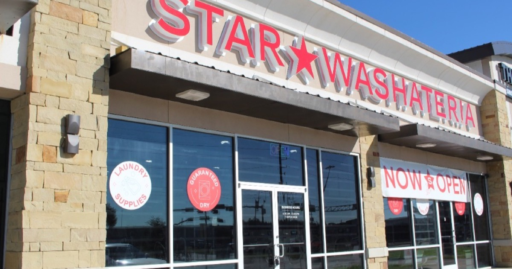

# Star Washateria — Laundromat Website



A fast, fully responsive, **bilingual (English / Spanish)** marketing website for Star Washateria, a full-service laundromat in Houston, Texas. Built from scratch with plain HTML, CSS, and JavaScript — no frameworks, no build step, no dependencies.

**🔗 Live site: [justinchung1201.github.io/starwashateria](https://justinchung1201.github.io/starwashateria/)**

---

## Why I built this

Star Washateria is a real, family-friendly laundromat in Houston's Brays Oaks neighborhood. Like a lot of local businesses, it had great service but little online presence — no easy way for neighbors to find its hours, services, weekly specials, or directions.

I built this site to give the business a clean, professional home on the web that:

- **Helps customers find and choose it** — clear hours, address, one-tap directions, and a click-to-call phone number.
- **Speaks to the whole neighborhood** — Brays Oaks has a large Spanish-speaking community, so the entire site can be toggled between English and Spanish in one click.
- **Drives real actions** — prominent "Get Directions," "Call Now," and "Schedule Pickup & Delivery" calls-to-action throughout.
- **Loads instantly on any phone** — most laundromat customers arrive on mobile, so the site is mobile-first and ships as a single lightweight page.

It's a small project with a real-world goal: help a local business get found and get customers.

## Features

- **🌐 One-click English / Spanish toggle** — every piece of visible copy translates instantly with no page reload. The site remembers the visitor's choice (`localStorage`) and auto-detects Spanish-language browsers on first visit.
- **📱 Fully responsive** — a mobile-first layout that adapts cleanly from phones to widescreen desktops, including a collapsible mobile nav.
- **🔎 SEO-ready** — semantic HTML plus [Schema.org](https://schema.org) structured data (`LocalBusiness` / `DryCleaningOrLaundry` and `FAQPage` JSON-LD) so search engines can surface hours, location, ratings, and FAQs.
- **📣 Social sharing** — Open Graph and Twitter Card metadata for rich link previews.
- **🗺️ Embedded Google Map** and deep links to directions.
- **🧺 Content sections** — hero, why-us, how-it-works, services, weekly specials, gallery, reviews, FAQ, and a visit/contact section.
- **♿ Accessibility-minded** — labeled controls, keyboard-friendly navigation, and meaningful alt text.

## Tech stack

| Area | Details |
|------|---------|
| Markup | Semantic HTML5 |
| Styling | Hand-written CSS3 (custom properties, Flexbox, CSS Grid, responsive breakpoints) |
| Behavior | Vanilla JavaScript (no libraries) |
| Internationalization | Custom lightweight i18n with a translation dictionary + `localStorage` |
| Hosting | GitHub Pages (static) |
| Tooling | None required — no build step, no package manager |

## Project structure

```
starwashateria/
├── index.html      # Entire page: content, structured data, and the i18n script
├── styles.css      # All styling (custom properties, responsive layout)
├── images/         # Photos, logo, favicon, and social-share image
└── README.md
```

## Running it locally

No build tools needed. Clone the repo and open the file, or serve it with any static server:

```bash
git clone https://github.com/justinchung1201/starwashateria.git
cd starwashateria

# Option 1: just open it
open index.html

# Option 2: serve locally (nicer for testing)
python3 -m http.server 8000
# then visit http://localhost:8000
```

## Implementation highlights

A few things I focused on that go beyond a basic static page:

- **Zero-dependency internationalization.** Rather than pulling in an i18n library, every translatable element is tagged with a `data-i18n` key. On load the script caches the original English, and toggling simply swaps each element's content against a Spanish dictionary — so the two language versions can never drift out of sync, and the page stays tiny.
- **Structured data for local SEO.** The JSON-LD blocks describe the business, its hours, reviews, and FAQs in a format Google understands, improving the odds of a rich result for local searches.
- **Performance by default.** Shipping plain HTML/CSS/JS with no framework runtime keeps the page fast on mobile networks, which is where most customers land.

## License

© 2026 Star Washateria. All rights reserved.

This repository is public for portfolio and demonstration purposes. The code, branding, images, and content are not licensed for reuse.

## Author

Built and maintained by **[@justinchung1201](https://github.com/justinchung1201)**.
